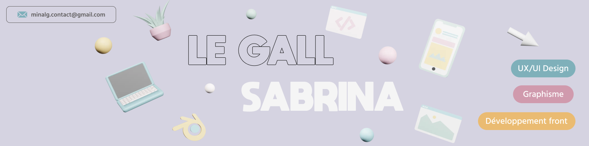

## Hi, I'm Sabrina 

👩‍💻 Currently seeking a position in web design. 
🎓 Recently graduated with a degree in Computer Science and Design from the IUT of Lannion. 
🌱 I am constantly learning to continuously improve my skills. 
​​🌌 I create websites and applications in my free time to stay consistent. 
✨ Find all my projects in my [portfolio](https://minalg.fr/)!

	
	

## Tech Stack 👩‍💻
         

## GitHub Stats 🌱​
 
 

<!--
**Minalg7/minalg7** is a ✨ _special_ ✨ repository because its `README.md` (this file) appears on your GitHub profile.

Here are some ideas to get you started:

- 🔭 I’m currently working on ...
- 🌱 I’m currently learning ...
- 👯 I’m looking to collaborate on ...
- 🤔 I’m looking for help with ...
- 💬 Ask me about ...
- 📫 How to reach me: ...
- 😄 Pronouns: ...
- ⚡ Fun fact: ...

(phrase d'introduction / description)
🧠​ Computer science and design student at CY Tech / CY Ecole de Design
​🌌​ I create themed desktop apps to stay consistent
👯 I’m looking to collaborate on projects that are using Python. (ce que je cherches actuellement)
🌱 I’m currently learning JavaScript and mathematics required for ML and Data Science. (ce que je suis entrain de faire)
✏️ I Write blogs on dev.to on free days.
portfolio lien

-->
